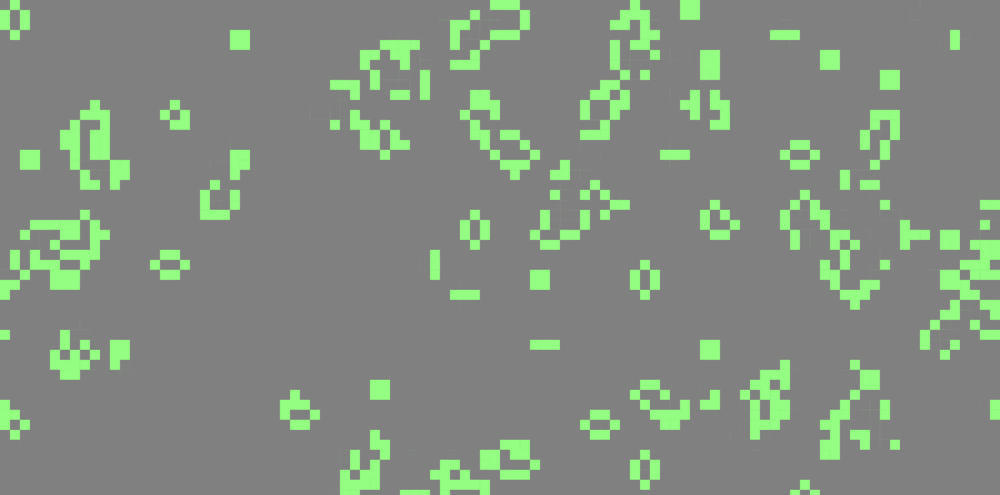

# Game of Life

*Created in 2019* 
A javascript implementation of [John Conway's](https://en.wikipedia.org/wiki/John_Horton_Conway) [Game of Life](https://en.wikipedia.org/wiki/Conway%27s_Game_of_Life). 
It uses [p5.js](https://p5js.org/) for the game objects and the game rendering.

# How to run
You can run this game by opening the [index.html](./index.html) in your browser or you can run a simple http server in the root folder of this repo e.g. (in python) `python -m http.server`

# Controls
`r` restart a new random game. 
`u` make framerate higher, the game will evolve faster. 
`d` make framerate lower, the game will evolve slower. 
`g` start a new game with the 'glidergun' configuration (it is broken at this current stage)
